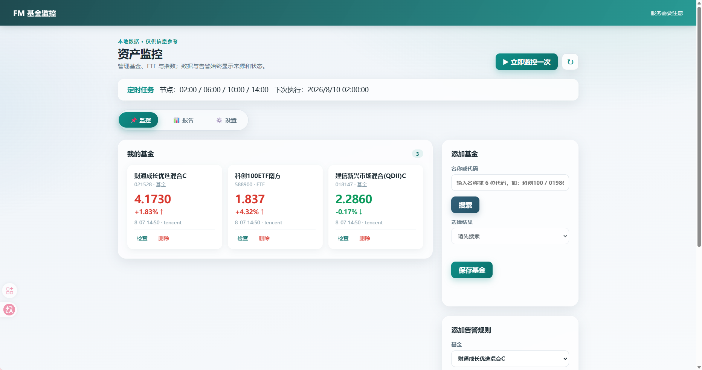
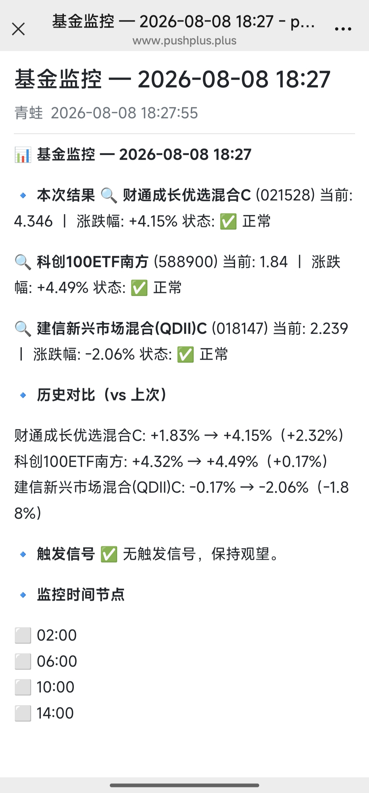

# 📈 Fund Monitor — 基金/指数自动监控，大跌微信提醒

> **不用盯盘**：把想看的基金加进去，跌到阈值、净值变动、分红、换经理，**自动推送到微信**。Windows 本地免费跑，或部署到 GitHub Actions 云端，电脑不开机也能盯着。

<br>

<p align="center">
  
</p>

<p align="center">
  <b>本地面板 · 实时行情 · 阈值告警 · 微信推送</b>
</p>

<p align="center">
  <a href="#%EF%B8%8F-快速开始"><b>🚀 快速开始</b></a> ·
  <a href="#-功能特性"><b>✨ 功能特性</b></a> ·
  <a href="#-演示"><b>🎬 演示</b></a> ·
  <a href="#-文档"><b>📚 文档</b></a>
</p>

<p align="center">
  
  
  
</p>

> ⚠️ 仅供信息参考，不构成投资建议。

---

## 🚀 快速开始（两种方式任选其一）

### 方式 A：Windows 本地端（推荐，零配置，免费）

1. 打开右侧 **Releases** → 下载最新版 `FundMonitor-x.y.z-windows.zip`
2. 解压 → 双击 `FundMonitor.exe`
3. 浏览器自动打开管理面板（http://127.0.0.1:8420）
4. 搜索添加基金 → 配置推送通道 → 点「立即监控一次」或等定时节点自动运行

### 方式 B：GitHub Actions 云端（电脑不用开机，免费）

1. **Fork 本仓库**（右上角 Fork，得到你自己的副本）
2. 在自己仓库配置密钥 `PUSHPLUS_TOKEN`（[pushplus.plus](https://pushplus.plus) 微信扫码注册获取）
   `Settings → Secrets and variables → Actions → New repository secret`
3. **网页配置要监控的基金**：打开 `Actions` 页 → 左侧 **update-config** → **Run workflow**，输入基金名称或代码（逗号分隔，可加阈值）：
   ```
   科创50:-1.5, 019860, 沪深300:-1.0
   ```
4. 交易日自动运行（北京时间 02:00/06:00/10:00/14:00），报告推送到微信；也可随时手动触发 **fund-monitor** workflow

> Fork 后如需改监控时间，编辑 `.github/workflows/monitor.yml` 里的 cron（UTC 时间）。

---

## ✨ 功能特性

- **📊 实时行情**：腾讯财经（指数/ETF/基金实时估值）优先 + 东方财富兜底
- **🔔 智能告警**：涨跌幅阈值 / 净值日变更 / 分红 / 经理变更；支持冷却时间、静默时段、按通道路由
- **📑 监控报告**：本次结果 / 历史对比 / 触发信号 / 时间节点，自动推送并保存，刷新不丢失
- **📱 多端推送**：PushPlus（微信 200条/天）/ Server酱 / 桌面通知（点击直达报告页）/ 邮件 / Telegram / Webhook，一键测试
- **⏰ 定时任务**：交易日 02:00/06:00/10:00/14:00 自动运行（可配置）
- **🖥️ 双端联动**：本地端管理基金 → 一键同步到云端（GitHub Token / gh CLI / 复制配置三种方式）

---

## 🎬 演示

<!-- TODO: 上传 1 张面板截图 + 1 张微信推送截图，替换下方占位 -->

**① 监控面板 — 实时行情与告警状态**


**② 微信推送 — 大跌自动提醒**



---

## 📁 项目结构

```
fund-monitor/
├── src/fund_monitor/        # 本地桌面应用（FastAPI + SQLite + 数据源适配器）
├── web/                     # 本地管理面板（浏览器界面）
├── headless/                # 云端监控脚本（GitHub Actions 使用）
│   ├── monitor.py           #   单次监控执行器（腾讯实时行情）
│   ├── generate_config.py   #   按名称/代码生成配置
│   └── config.yaml          #   资产与阈值配置
├── .github/workflows/       # 云端工作流
│   ├── monitor.yml          #   定时监控 + 推送
│   └── update-config.yml    #   网页表单更新配置
├── packaging/               # Windows 打包脚本
├── docs/                    # 用户文档（产品/上手/配置/推送/疑难/隐私/风险）
└── tests/                   # 自动化测试（101 个用例）
```

## 💰 资产代码格式（添加基金时使用）

| 类型 | 格式 | 例子 |
|---|---|---|
| A股指数 | `sh`/`sz` + 6位 | `sh000001` 上证指数、`sz399006` 创业板指 |
| 场内 ETF | `sh`/`sz` + 6位 | `sh510300` 沪深300ETF |
| 场外基金 | `jj` + 6位 | `jj019860` 某科创100ETF联接C |

直接输入名称或 6 位代码也可以（自动识别）。

---

## 🛠️ 开发与测试

```bash
# 本地开发
python -m venv .venv
.venv/Scripts/pip install -e ".[dev]"      # Windows
python -m pytest                            # 运行全部测试
python -m fund_monitor                      # 启动本地服务（面板 127.0.0.1:8420）

# Windows 打包
powershell -File packaging/build.ps1        # 生成 dist/FundMonitor.exe
powershell -File packaging/package-release.ps1
```

## 🔒 数据与隐私

- 数据与密钥仅存本机（`%LOCALAPPDATA%\FundMonitor`），不主动上传
- 本地服务仅绑定 `127.0.0.1`；通知密钥存入 Windows 凭据库，导出配置不含密钥
- 详细说明见 [docs/06-privacy-and-data.md](docs/06-privacy-and-data.md)

## 📚 文档

- [产品介绍](docs/01-product-overview.md) · [快速上手](docs/02-quick-start-windows.md) · [基金配置](docs/03-asset-and-alert-configuration.md) · [推送通道](docs/04-notification-channels.md) · [疑难解答](docs/05-troubleshooting.md) · [隐私](docs/06-privacy-and-data.md) · [风险免责](docs/07-risk-disclaimer.md)

---

## ⭐ 支持这个项目

觉得有用的话，右上角点个 **Star** ⭐ 就是对我最大的支持！也欢迎提 [Issue](https://github.com/Frog755/fund-monitor/issues) 反馈建议或需求。

## License

本仓库为私有项目，保留所有权利；对外分发与使用请遵循双方约定。